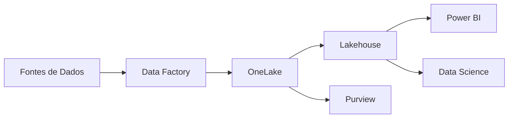

## Introdução

Durante minha experiência como Gerente de Transformação Digital na Londong Consulting Group, tive a oportunidade de liderar a implementação do Microsoft Fabric para processar milhões de registros diários. Neste artigo, compartilho as principais lições aprendidas e melhores práticas.

## Por que Microsoft Fabric?

O Microsoft Fabric representa uma evolução significativa na plataforma de dados da Microsoft, unificando várias ferramentas em uma única solução SaaS:

- **Data Factory**: Para ETL/ELT
- **Synapse Analytics**: Para analytics em larga escala
- **Power BI**: Para visualização integrada
- **Data Activator**: Para automação baseada em eventos
- **Data Science**: Para ML e AI

### Desafios do Projeto

1. **Volume de Dados**: Processar milhões de registros em tempo real
2. **Integração**: Conectar sistemas legados com arquitetura moderna
3. **Governança**: Estabelecer políticas de dados desde o início
4. **Performance**: Garantir latência mínima para decisões em tempo real

## Arquitetura Implementada



### Camadas da Solução

1. **Ingestão**: Data Factory com pipelines incrementais
2. **Armazenamento**: OneLake como Data Lake centralizado
3. **Processamento**: Lakehouse com Delta Tables
4. **Governança**: Purview para catálogo e qualidade
5. **Consumo**: Power BI Direct Lake para análises em tempo real

## Implementação Passo a Passo

### 1. Planejamento e Design

```python
# Definição de schemas com Delta Lake
from pyspark.sql.types import StructType, StructField, StringType, IntegerType, TimestampType

schema_transacao = StructType([
    StructField("id", StringType(), False),
    StructField("timestamp", TimestampType(), False),
    StructField("valor", IntegerType(), True),
    StructField("status", StringType(), True)
])
```

### 2. Criação de Pipelines

Utilizamos Data Factory para criar pipelines robustos:

- **Incremental Load**: Apenas dados novos ou modificados
- **Error Handling**: Tratamento de falhas com retry logic
- **Monitoring**: Logs detalhados para troubleshooting

### 3. Governança de Dados

Implementamos 16 procedimentos ativos de governança:

| Procedimento | Descrição | Frequência |
|--------------|-----------|------------|
| Validação de Schemas | Verifica estrutura dos dados | Diário |
| Qualidade de Dados | Métricas de completude | Diário |
| Catalogação | Atualiza catálogo no Purview | Semanal |
| Auditoria de Acesso | Monitora acessos | Contínuo |

## Resultados Obtidos

### Impacto Operacional

- ✅ **+3.7% no tráfego** em horários de pico
- ✅ **16 procedimentos** de governança ativos
- ✅ **Milhões de registros** processados diariamente
- ✅ **Latência <2s** para queries em tempo real

### Métricas Técnicas

```sql
-- Exemplo de query otimizada no Lakehouse
SELECT 
    DATE(timestamp) as data,
    COUNT(*) as total_transacoes,
    SUM(valor) as valor_total,
    AVG(valor) as ticket_medio
FROM transacoes
WHERE timestamp >= CURRENT_DATE - INTERVAL 30 DAY
GROUP BY DATE(timestamp)
ORDER BY data DESC
```

**Performance**: Query executada em média de 1.2 segundos sobre 50M de registros.

## Lições Aprendidas

### 1. Comece com OneLake

OneLake é o coração do Fabric. Centralize todos os dados aqui antes de processá-los.

### 2. Use Delta Lake

Delta Tables oferece:
- ACID transactions
- Time travel
- Schema evolution
- Performance superior

### 3. Implemente DataOps desde o Início

```yaml
# Exemplo de CI/CD para Fabric
name: Deploy Fabric Workspace
on:
  push:
    branches: [main]

jobs:
  deploy:
    steps:
      - name: Deploy Notebooks
        run: |
          fabric deploy --workspace prod \
            --items notebooks/*.ipynb
```

### 4. Governança Não é Opcional

Estabeleça:
- Catálogo de dados no Purview
- Glossário de negócios
- Políticas de acesso (RBAC)
- Monitoramento de qualidade

## Melhores Práticas

### Performance

1. **Particionamento**: Particione por data para queries temporais
2. **Compressão**: Use Parquet com compressão Snappy
3. **Caching**: Ative cache para datasets frequentes
4. **Direct Lake**: Use modo Direct Lake no Power BI

### Segurança

1. **Workspace Roles**: Defina papéis claramente
2. **Row-Level Security**: Implemente RLS no Power BI
3. **Encryption**: Dados em repouso e em trânsito criptografados
4. **Audit Logs**: Monitore todos os acessos

### Custos

```python
# Otimização de custos com Spark
spark.conf.set("spark.sql.adaptive.enabled", "true")
spark.conf.set("spark.sql.adaptive.coalescePartitions.enabled", "true")
```

Reduzimos custos em ~30% com:
- Adaptive Query Execution
- Auto-scaling de recursos
- Scheduled suspend para ambientes dev/test

## Roadmap Futuro

Nossa próxima fase inclui:

1. **Data Activator**: Alertas em tempo real
2. **AI Integration**: Modelos ML no Fabric
3. **Real-time Analytics**: Streaming com Event Stream
4. **Copilot**: Assistente AI para análise de dados

## Conclusão

Microsoft Fabric transformou nossa capacidade de processar e analisar dados em escala. Os principais fatores de sucesso foram:

- ✅ Planejamento cuidadoso da arquitetura
- ✅ Foco em governança desde o dia 1
- ✅ Adoção de DataOps
- ✅ Treinamento contínuo da equipe
- ✅ Monitoramento proativo

## Recursos Adicionais

- [Documentação Oficial Fabric](https://learn.microsoft.com/fabric)
- [Minha Certificação](https://learn.microsoft.com/users/sergioqueiroz/credentials)
- [OneLake Guide](https://learn.microsoft.com/fabric/onelake)

---

**Sobre o Autor**: Sergio Carvalho Queiroz é Gerente de Transformação Digital na Londong Consulting Group, Microsoft Certified Fabric Analytics Engineer e especialista em Data Governance. Conecte-se no [LinkedIn](https://www.linkedin.com/in/queirozsc/).

**Tags**: #MicrosoftFabric #DataEngineering #Analytics #DataGovernance #OneLake #DeltaLake
